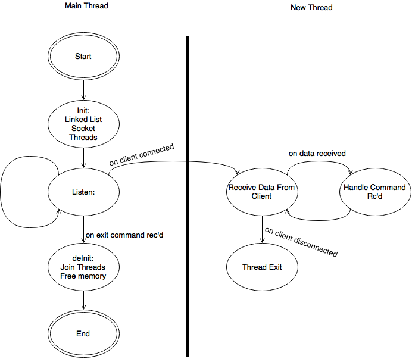
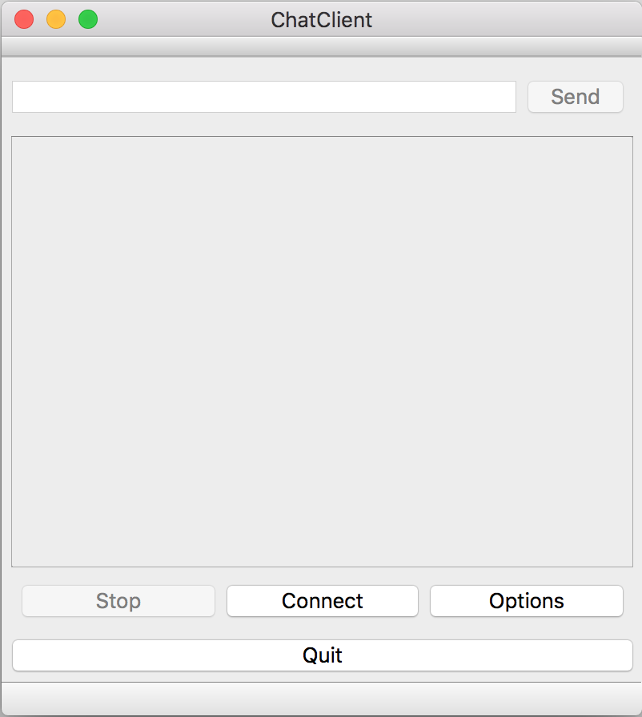
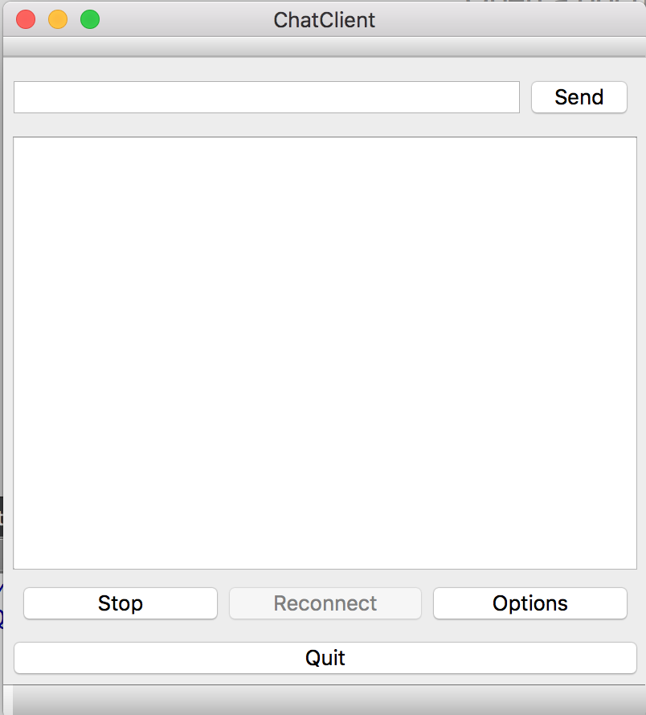
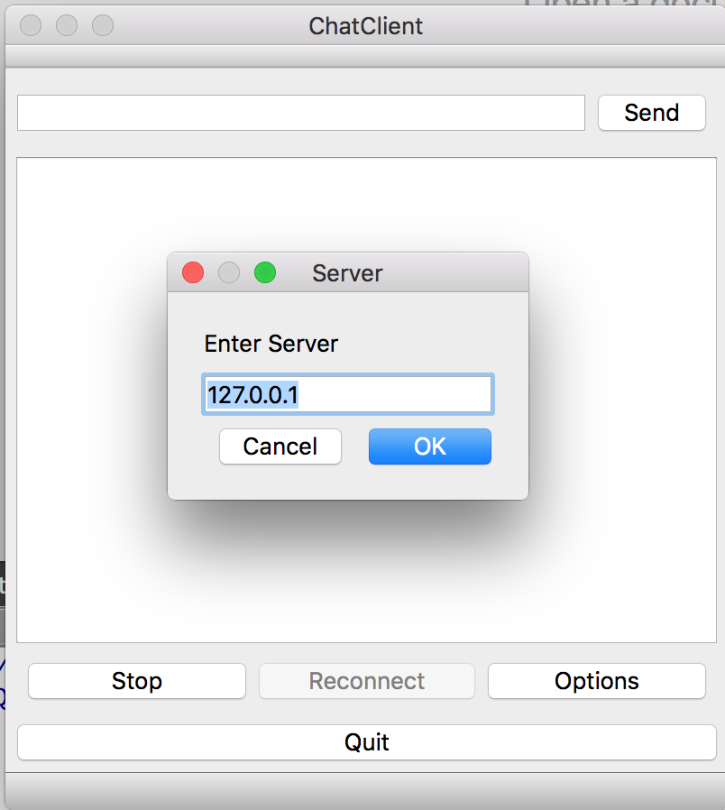
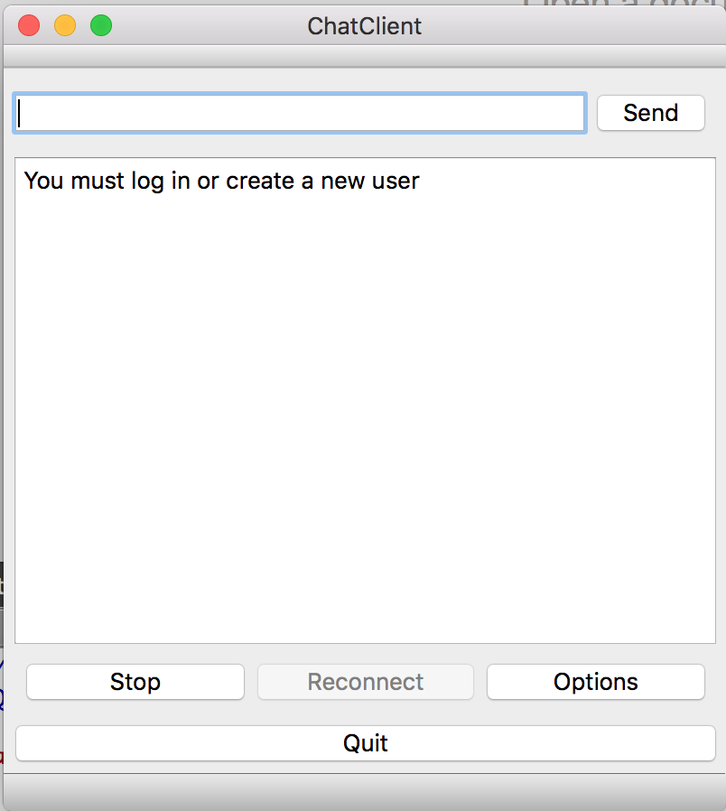
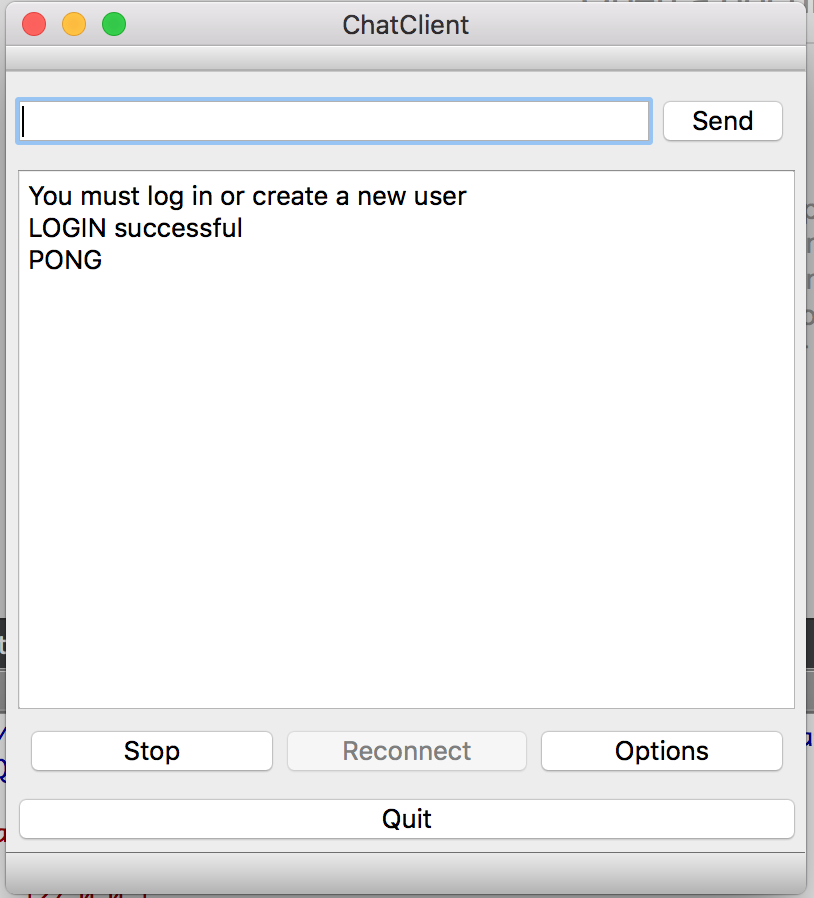

# PatChat
Simple Chatting Application, with a server written in C, and GUI Client in C++ and Crappy CLI Client in C#. The main focus, for now, client side is the GUI in the QTChatClient directory.

##Features
1. Heartbeat from server to Clients connected every 5-ish seconds
2. Broadcast a message to all connected clients
3. Send a message to a specific client
4. Create username
5. Login as a user
6. List all connected users
7. Endless unique usernames of up to ten characters
8. Up to 5 clients connected at once
9. Server ping
10. Change options such as local echo and muting all contact from the server to the client. 
11. Accessing a helpfile by using OPT $HELP

##Client Commands
**NEW USERNAME**

Usage: NEWUSER (name)

Creates a new username in the chat server

**BROADCAST MESSAGE**

Usage: BROADCAST (msg)

Sends a message to all connected users

**LIST USERS**

Usage: LIST 

Lists all corrently connected users

**PING**

Usage: PING

Get a PONG from the server

**SEND MESSAGE**

Usage: SEND $(user) (msg)

Send a message to the user specified, this is echo'd to the sender

**BEAT**

HEart beat sent from server to clients

**ACK**

Client acknowledge heartbeat

**OPT**

Usage: OPT $<option 1> $<option 2> ...

Allows the currently logged in user to access the following commands:
$ECHO toggle echo on send
$SILENT toggles silence
$ME? gets current username
$ECHO? get current echo state
$SILENT? get current cilent state
$NEWNAME <new name> change the current username to the new name passed in. This will permanently delete the curent username from the server //NOT IMPLEMENTED

##Challenges
- Command Line Client recieve. The client must listen all the time for an incoming message from the server. To overcome this a thread is created which listens all the time, by using an Asynchronous `NetworkStream.BeginRead()` in a while loop. 
- Server HeartBeat. The server sends a heart beat to the connected clients every 5 seconds - this is handled in it's own thread.
- Server Username storage. The server saves new usernames to a text file, and reads from this file on startup. This gives persistent usernames so a if the server is quit the usernames are remembered.
- Getting the server to stop safely rather than my closing the process in the IDE or using a keyboard interrupt. Still don't know how I'm going to do it yet - but it's a to do item.

##To Improve
- Dynamic commands, maybe from a setup file etc
- Testing! 
- Server
  - [X] Connected client FD in a struct with their username too.
  - [X] Thread ID's stored in a separate array - should be in the `CURRENT_CONNECTIONS` array or structs
  - [ ] The server doesn't act on the heartbeat ACK from the clients, either remove it or find a use for it
  - [ ] The server had no way of being quit once it's running, so although the code in place to free memory used and join the threads, it's never used
  - [ ] Refactor the source code into different files
  - [ ] Dynamic list of usernames which can grow/shink as clients connect
  - [X] Saving usernames to a file for later re-use
  - [X] Options Flags
  - [X] Ability to change the current username, requires
    - [X] Linked list item removal
    - [X] Tokenising the OPT string by space as well as by '$' 
  - [ ] Error handling - at the moment there is little by way of error handling and feedback to clients if an error occurs.

- Client
  - [ ] ~~If running for ages the garbage collector throws an error as it's unable to allocated some memory - not sure yet where it's being allocated.~~ Doesn't seem to be present in QT Gui
  - [X] GUI would be nice, failing that a more smart console interface
  - [X] LOGOUT command
  - [ ] ~~Some client side checking of the replies from the Server or the input commands~~ Server side does the checking so this is pointless extra processing

##Server Design
Although the server doesn't use 'state's, the following diagram helps to explain what it does

##GUI Images

